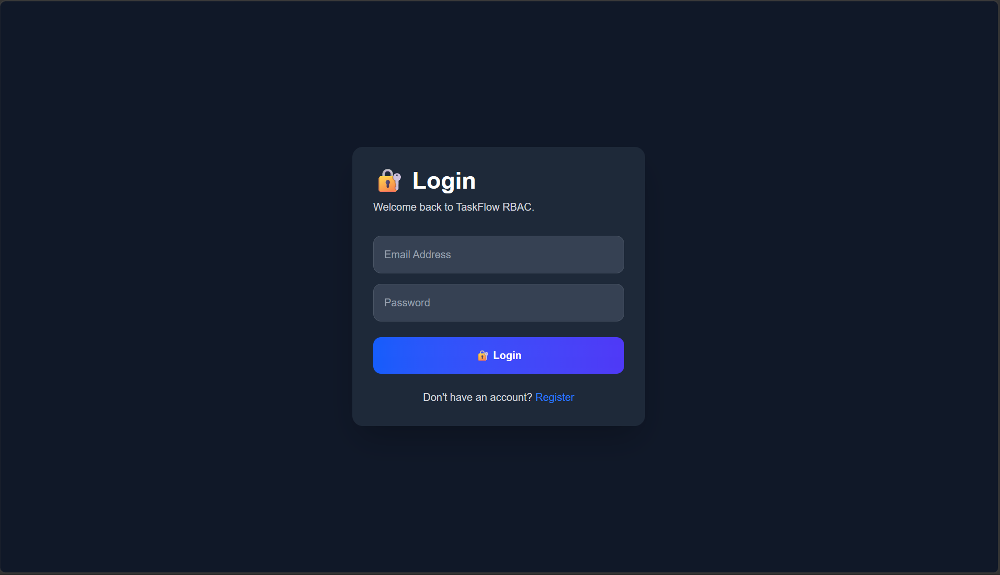
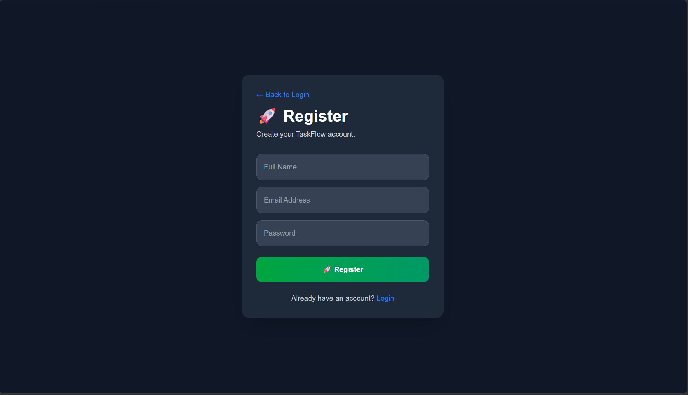
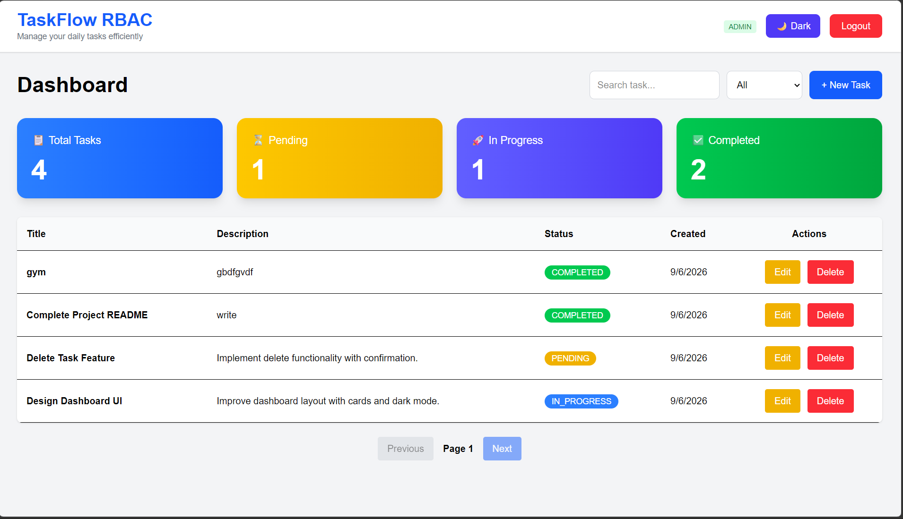
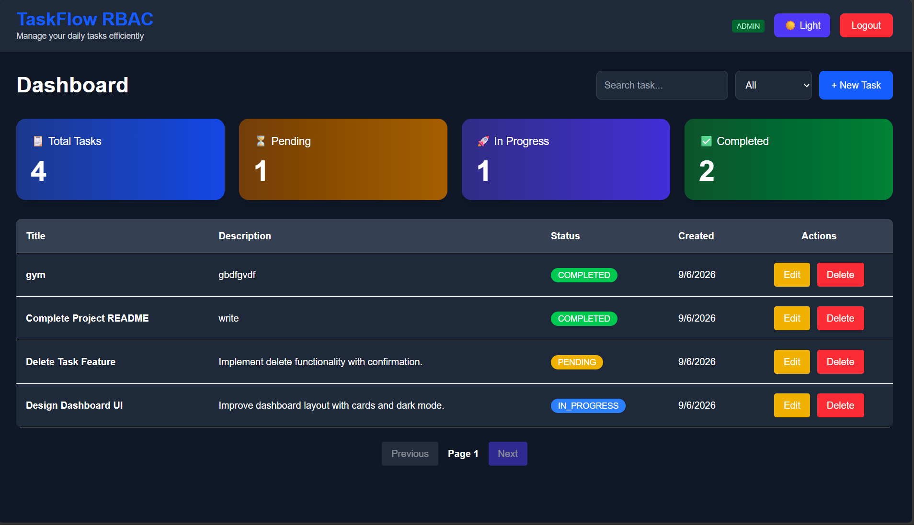
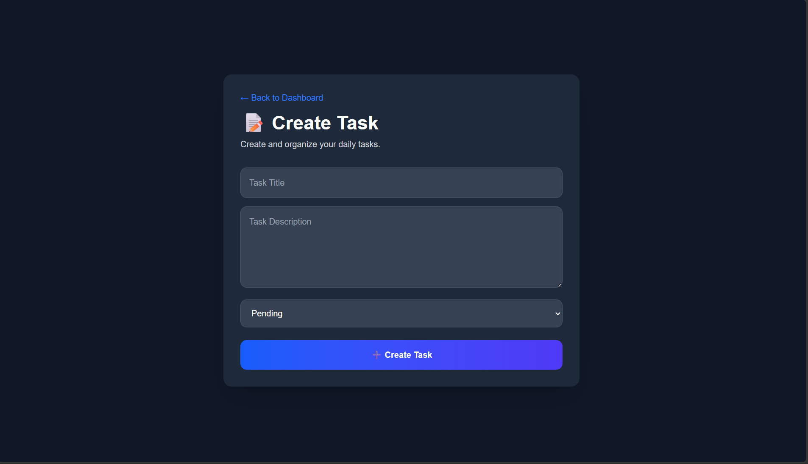
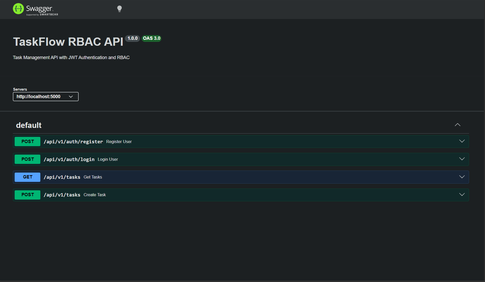

# 🚀 TaskFlow RBAC System

> **A Production-Ready Full Stack Role-Based Task Management System built with Next.js, Node.js, Express.js, PostgreSQL, Prisma ORM, JWT Authentication, and Docker.**

Secure • Scalable • Responsive • Modern UI • Production Ready

---

# 🌐 Live Demo

### 🔗 Frontend

https://taskflow-rbac-system-ten.vercel.app

### 🔗 Backend API

https://YOUR-BACKEND-URL.onrender.com

### 🔗 Swagger Documentation

https://YOUR-BACKEND-URL.onrender.com/api-docs

---

# 📖 Overview

TaskFlow RBAC System is a **production-ready Full Stack Task Management Application** implementing **Role-Based Access Control (RBAC)**.

The project demonstrates industry-standard backend and frontend development practices including:

* JWT Authentication
* Role-Based Authorization
* Secure REST APIs
* PostgreSQL Database Design
* Prisma ORM
* Responsive Next.js Frontend
* Pagination & Filtering
* Dockerized Database
* Swagger Documentation
* Scalable Layered Architecture

Users can manage their own tasks while administrators can manage every task and user across the system.

---

# ✨ Features

## 🔐 Authentication

* User Registration
* User Login
* JWT Authentication
* Password Hashing (bcryptjs)
* Protected Routes
* Current User API
* Logout Functionality

---

## 👥 Role-Based Access Control (RBAC)

### USER

* Create Own Tasks
* View Own Tasks
* Update Own Tasks
* Delete Own Tasks

### ADMIN

* View All Tasks
* Manage All Tasks
* Access Any User's Tasks

---

## 📝 Task Management

* Create Task
* View Tasks
* Get Task By ID
* Update Task
* Delete Task

---

## 📊 Dashboard Features

* Total Tasks Card
* Pending Tasks Card
* In Progress Tasks Card
* Completed Tasks Card
* Search Tasks
* Status Filter
* Pagination
* Created Date
* Responsive Table
* Empty State UI
* Loading Spinner
* Dark Mode
* Responsive Design

---

# 🛠 Tech Stack

## Frontend

* Next.js 16 (App Router)
* React.js
* JavaScript
* Tailwind CSS
* Axios
* React Hook Form
* React Hot Toast
* Context API

---

## Backend

* Node.js
* Express.js
* PostgreSQL
* Prisma ORM
* JWT Authentication
* bcryptjs
* Zod Validation
* Swagger
* Docker

---

# 🏗 System Architecture

```
                    Browser

                       │

                       ▼

            Next.js Frontend (React)

                       │

                Axios HTTP Client

                       │

                       ▼

             Express REST API Server

                       │

      ┌────────────────┼─────────────────┐

      ▼                ▼                 ▼

 Authentication   Task Controller   Middleware

                       │

                       ▼

                    Services

                       │

                       ▼

                  Prisma ORM

                       │

                       ▼

              PostgreSQL Database
```

---

# 📂 Project Structure

```
taskflow-rbac-system/

│

├── assets/
│    ├── landing.png
│    ├── login.png
│    ├── register.png
│    ├── dashboard-dark.png
│    ├── dashboard-light.png
│    ├── create-task.png
│    ├── edit-task.png
│    └── swagger.png
│

├── backend/
│
│   ├── prisma/
│   │     ├── migrations/
│   │     ├── schema.prisma
│   │     └── seed.js
│   │
│   ├── src/
│   │     ├── config/
│   │     ├── controllers/
│   │     ├── middleware/
│   │     ├── routes/
│   │     ├── services/
│   │     ├── validators/
│   │     ├── utils/
│   │     ├── app.js
│   │     └── server.js
│   │
│   └── package.json
│
├── frontend/
│
│   ├── app/
│   │     ├── dashboard/
│   │     ├── login/
│   │     ├── register/
│   │     └── tasks/
│   │           ├── create/
│   │           └── edit/[id]/
│   │
│   ├── components/
│   ├── context/
│   ├── lib/
│   ├── services/
│   ├── public/
│   └── package.json
│
├── docker-compose.yml
│
└── README.md
```

---

# 🗄 Database Schema

## User

| Field     | Type         |
| --------- | ------------ |
| id        | UUID         |
| name      | String       |
| email     | String       |
| password  | String       |
| role      | ADMIN / USER |
| createdAt | DateTime     |

---

## Task

| Field       | Type                              |
| ----------- | --------------------------------- |
| id          | UUID                              |
| title       | String                            |
| description | String                            |
| status      | PENDING / IN_PROGRESS / COMPLETED |
| userId      | UUID                              |
| createdAt   | DateTime                          |
| updatedAt   | DateTime                          |

---

# 📊 Entity Relationship Diagram

```
User

├── id
├── name
├── email
├── password
├── role
└── createdAt

      │

      │ 1

      ▼

Task

├── id
├── title
├── description
├── status
├── userId
├── createdAt
└── updatedAt
```

---

# 🔐 Authentication Flow

```
User Login

      │

      ▼

Validate Credentials

      │

      ▼

Generate JWT

      │

      ▼

Return Token

      │

      ▼

Store Token

      │

      ▼

Protected Request

      │

      ▼

Verify JWT

      │

      ▼

Access Granted
```

---

# 🛡 RBAC Flow

```
Request

    │

    ▼

JWT Middleware

    │

    ▼

Extract User

    │

    ▼

Check Role

    │

 ┌──┴──────────┐

 ▼             ▼

ADMIN         USER

 │             │

 │             ▼

 │      Check Ownership

 │             │

 ▼             ▼

Access      Allow / Deny
```

---

# 📡 REST API Endpoints

## Authentication

```
POST /api/v1/auth/register

POST /api/v1/auth/login

GET /api/v1/auth/me
```

---

## Tasks

```
POST /api/v1/tasks

GET /api/v1/tasks

GET /api/v1/tasks/:id

PUT /api/v1/tasks/:id

DELETE /api/v1/tasks/:id
```

---

# 📄 Pagination

```
GET /api/v1/tasks?page=1&limit=10
```

---

# 🔍 Filtering

```
GET /api/v1/tasks?status=PENDING

GET /api/v1/tasks?status=IN_PROGRESS

GET /api/v1/tasks?status=COMPLETED
```

---

# 📖 Swagger Documentation

Run Backend:

```
npm run dev
```

Open:

```
http://localhost:5000/api-docs
```

Swagger provides interactive testing for every API endpoint.

---

# 📷 Screenshots

Create an **assets** folder and add these screenshots:

```
assets/

landing.png

login.png

register.png

dashboard-light.png

dashboard-dark.png

create-task.png

edit-task.png

swagger.png
```

Then add:

```
## Landing Page


---

## Login Page



---

## Register Page



---

## Dashboard (Light)



---

## Dashboard (Dark)



---

## Create Task



---

## Edit Task


---

## Swagger


```

---

# 🧪 Testing

Tested using:

* Postman
* Swagger UI
* Browser Frontend

### Tested Scenarios

✅ Registration

✅ Login

✅ JWT Authentication

✅ Protected Routes

✅ RBAC

✅ Create Task

✅ Update Task

✅ Delete Task

✅ Pagination

✅ Filtering

✅ Search

✅ Dashboard

✅ Dark Mode

---

# ⚙ Environment Variables

## Backend

```
PORT=5000

DATABASE_URL=your_database_url

JWT_SECRET=your_secret
```

---

## Frontend

```
NEXT_PUBLIC_API_URL=http://localhost:5000/api/v1
```

---

# 🐳 Docker

Start PostgreSQL:

```
docker compose up -d
```

Stop:

```
docker compose down
```

---

# 🚀 Installation

## Clone Repository

```
git clone https://github.com/Jharwal77/taskflow-rbac-system.git

cd taskflow-rbac-system
```

---

## Backend Setup

```
cd backend

npm install

npx prisma migrate dev

npx prisma generate

npm run seed

npm run dev
```

---

## Frontend Setup

```
cd frontend

npm install

npm run dev
```

---

## Open

Frontend

```
http://localhost:3000
```

Backend

```
http://localhost:5000
```

Swagger

```
http://localhost:5000/api-docs
```

---

# 🚀 Deployment

## Frontend

Vercel

```
https://taskflow-rbac-system-ten.vercel.app
```

---

## Backend

Render

```
https://YOUR-BACKEND.onrender.com
```

---

# 💼 Skills Demonstrated

* Full Stack Development
* Next.js App Router
* React.js
* Tailwind CSS
* Node.js
* Express.js
* PostgreSQL
* Prisma ORM
* JWT Authentication
* Role-Based Access Control (RBAC)
* REST API Development
* Axios Integration
* Context API
* React Hook Form
* Docker
* Swagger Documentation
* Pagination
* Filtering
* Search
* Dark Mode
* Protected Routes
* Responsive UI
* Git & GitHub

---

# 📈 Scalability Considerations

* Redis Cache
* Horizontal Scaling
* Connection Pooling
* Read Replicas
* Load Balancer
* Microservices
* RabbitMQ
* Kubernetes
* Activity Logs
* Notification Service

---

# 🔮 Future Enhancements

* User Profile
* Refresh Token Authentication
* Email Verification
* Forgot Password
* Charts & Analytics
* File Uploads
* Sidebar Navigation
* Activity Logs
* Redis Cache
* Unit Testing
* Integration Testing
* CI/CD Pipeline

---

# 👨‍💻 Author

## Rahul Meena

Electronics & Communication Engineering Student

Full Stack Developer

Interested in Backend Engineering, Databases, Distributed Systems and Scalable Web Applications.

GitHub:

https://github.com/Jharwal77

---

# ⭐ Project Highlights

* JWT Authentication
* Role-Based Access Control
* Next.js App Router
* Express REST APIs
* PostgreSQL
* Prisma ORM
* Docker Support
* Swagger Documentation
* Responsive Dashboard
* Dark Mode
* Pagination & Filtering
* Production Ready Architecture

---

⭐ **If you found this project useful, please consider giving it a Star on GitHub!**
